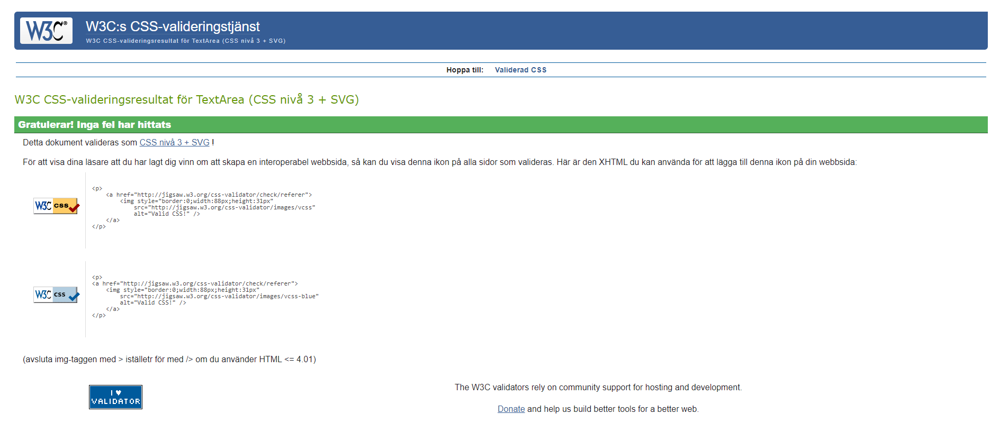
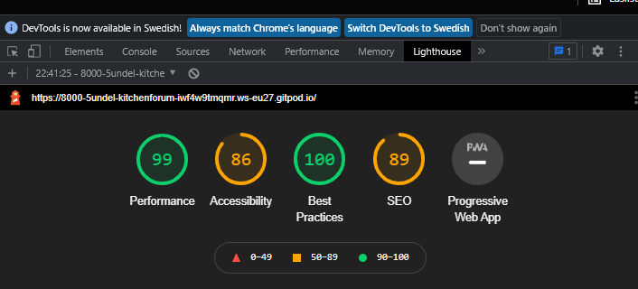
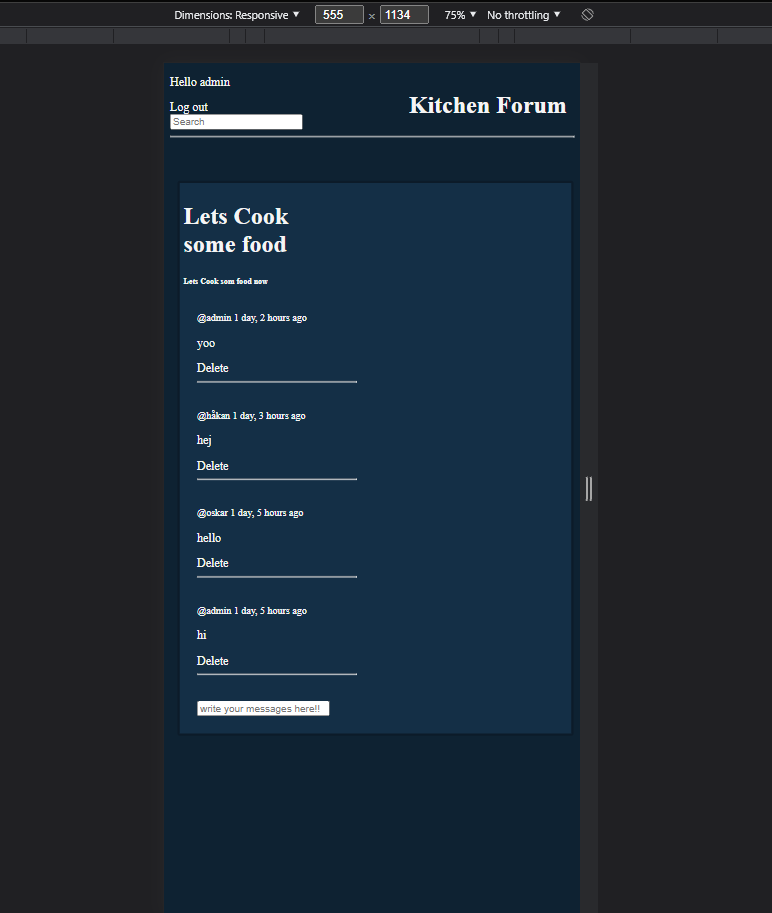
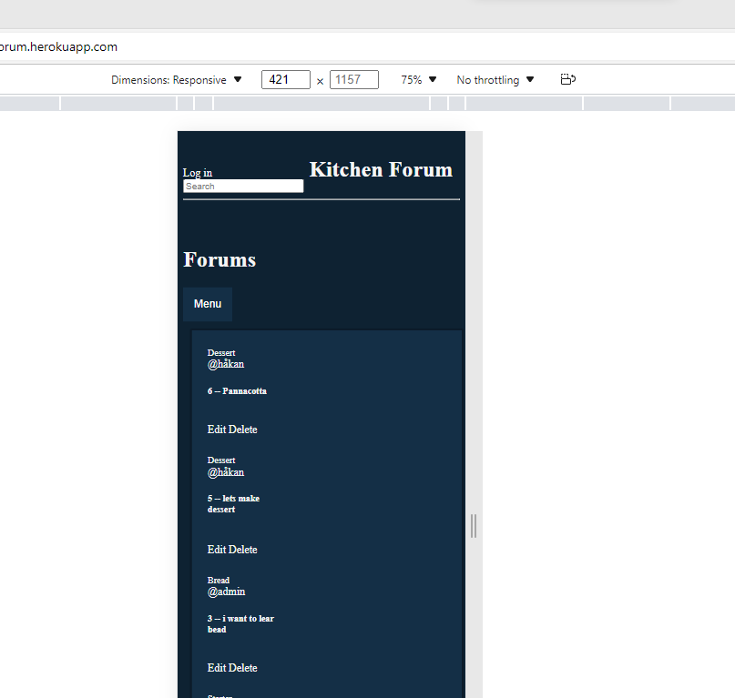
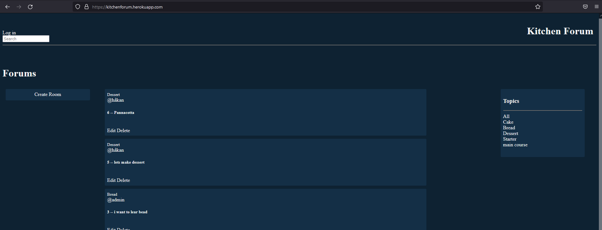
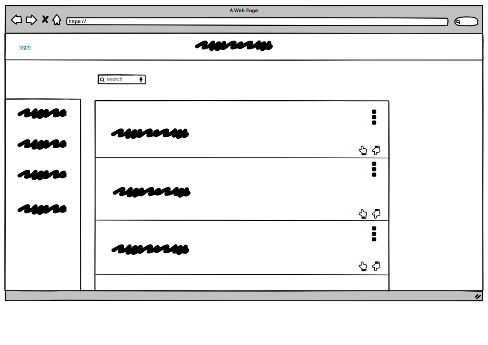

# KitchenForum
This page is created for those who love food and want to discuss with people who love it just as much.

## UX
- As a first-time user on the page, I want to be able to easily create a user and easily participate in various conversations which interests them.

## Features
   + Register & login
   + Topics
   + search bar
   + Create room
   + Comment, delete & edit post

## Deployment
  #### Local deployment
   - repo is found here https://github.com/5undel/kitchen-forum
   - Click the green button "Gitpod"
   - Lunch the site
   - In the terminal - pyton manage.py runserver
   -  click the link the pops up in the right bottom corner 
   -Or click Ctrl + http://127.0.0.1:8000/ in the terminal

  #### Heroku Setup and CLI
   - Create an account with https://id.heroku.com/login
   - Create new Heroku App - App_name & Location = Europe
   - Resources Tab, Add-ons, search for  ‘Heroku Postgres’
   - Go to Settings Tab, click reveal Config Vars and add DISABLE_COLLECTSTATIC, 1.
   - Go to Deploy - Deployment method and connect to Github
   - Connect to GitHub search for repo-name = kitchen-forum and connect.
   - Go sown to Manual deploy - Choose a branch to deploy - masterbranch
   - Click deploy Branch.
   - After depolyd click "Open app" 

   - Click login button
   - Click the Register button and create a user.

## Test
- Jigsaw

- Lighthouse

### WEBBROWSER
- Chrome

- Edge

- Fierfox

## Credit
 - 
 -
 -

## Fix

## Future plans
- Add setting to userpage so the user can add BIO, avatar och links
- Add other users as friends

### wireframe
 - Home page
  
