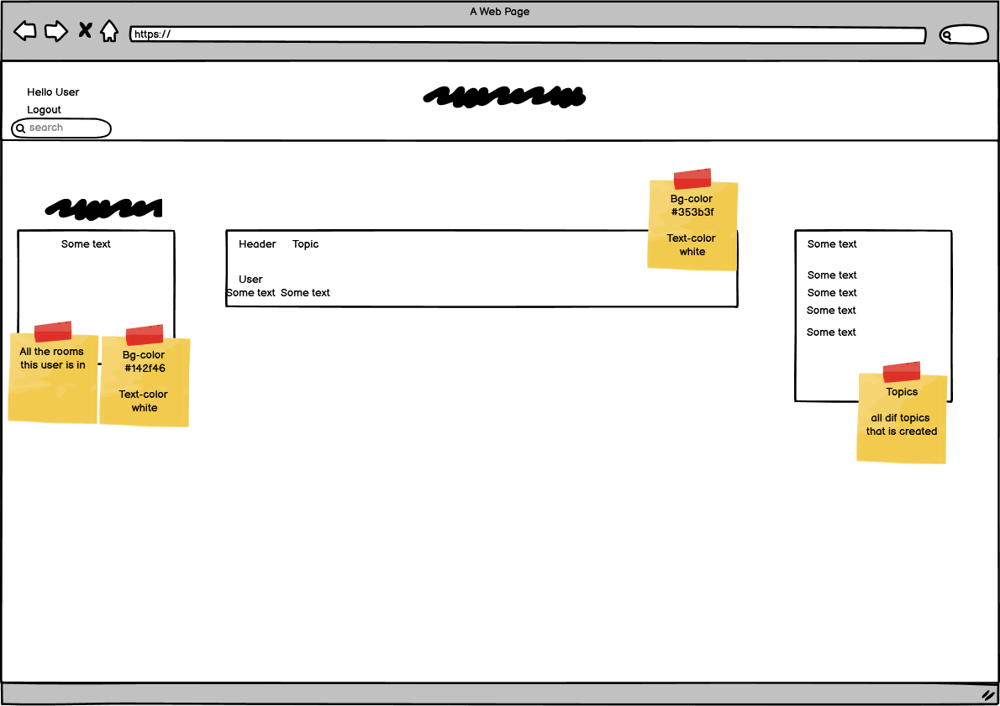

# KitchenForum
This site is for those who love food and want to share with people who love it as well.

## UX
- When I first join the site, I want it to be easy to create a user and participate in the various conversations that interest them.

## Functions
  -Register & Login 

  
 
 
  - search bar

 

  -  create room + comment, delete and edit post

 
  

## Deployment
  #### Local deployment
   - repo is found here https://github.com/5undel/kitchen-forum
   - Click the green button "Gitpod"
   - Lunch the site
   - In the terminal - pyton manage.py runserver
   -  click the link the pops up in the right bottom corner 
   -Or click Ctrl + http://127.0.0.1:8000/ in the terminal

  #### Heroku Setup and CLI

This project has been deployed to Heroku.
Steps taken to deploy are as follows:

- Create a **requirements.txt** file using the terminal command 'pip3 freeze --local > requirements.txt'
- Create a **Procfile** with the terminal command 'echo web: python3 run.py > Procfile'
- 'git add' and 'git commit' the new **requirements** and **Procfile**, then 'git push' the project to GitHub.
- install **whitenoise**, 'pip3 install whitenoise' . Whitenoise will take care of the static file when you deploy the project to heroku.
after you install whitenoise, you have to freeze the requirements again.
'pip3 freeze --local > requirements.txt'

- Navigate over to Heroku.com
- Click the "new" button, and give the project a name & set the region to Europe.
- From the Heroku dashboard of your newly created application, click on "Deploy" > "Deployment method" and select GitHub.
- Confirm the linking of the Heroku app to the correct GitHub repository.
- Select "Enable Manual Deployment", and then click the "Deploy" button.

The live link can be found here - https://kitchenforum.herokuapp.com/
 - Click the login link at the top left, at the login page click the register link to create a account.  

## Test
- Puzzle game

- Lighthouse

- Python (PEP8online.com) 

### WEBBROWSER
- chrome

- edge

- Fierfox

## credit
 - django model tutorial is from https://docs.djangoproject.com/en/4.0/topics/db/models/
 - Front-end color idea [kitchen and table](https://kitchenandtable.se/uppsala/)
 -

## future plans
- Add settings to user page so user can add BIO, avatar and links
- Add other users as friends

### Wireframe
 - Home page 
 - Room 
 - Create room 
 - profile 
 - Login 
 - register 

### Program structure 

### Design process - Contrast grid 
- The color scheme I chose for this 

 project was meant to be calming and not too prominent.
The thought behind it came to me after seeing what the front end of [kitchen and table](https://kitchenandtable.se/uppsala/) looked like.