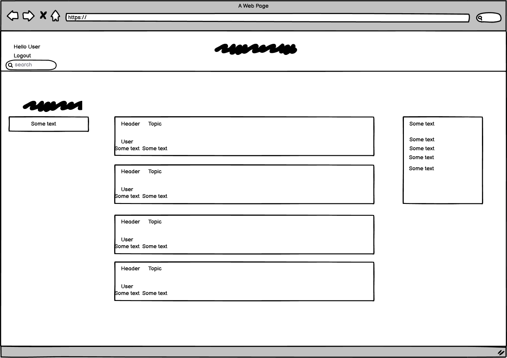

# KitchenForum
This page is created for those who love food and want to discuss with people who love it just as much.

## UX
- As a first-time user on the page, I want to be able to easily create a user and easily participate in various conversations which interests them.

## Features

   
   + Register & login

   
   + Topics
   

   + Search bar

 
 
   + Create room
   + Comment, Delete & Edit post

## Deployment
  #### Local deployment
   - repo is found here https://github.com/5undel/kitchen-forum
   - Click the green button "Gitpod"
   - Lunch the site
   - In the terminal - pyton manage.py runserver
   -  click the link the pops up in the right bottom corner 
   -Or click Ctrl + http://127.0.0.1:8000/ in the terminal

  #### Heroku Setup and CLI

This project has been deployed to Heroku.
Steps taken to deploy are as follows:

- Create a **requirements.txt** file using the terminal command `pip3 freeze --local > requirements.txt`
- Create a **Procfile** with the terminal command `echo web: python3 run.py > Procfile`
- `git add` and `git commit` the new **requirements** and **Procfile**, then `git push` the project to GitHub.

- Navigate over to Heroku.com
- Click the "new" button, and give the project a name & set the region to Europe.
- From the Heroku dashboard of your newly created application, click on "Deploy" > "Deployment method" and select GitHub.
- Confirm the linking of the Heroku app to the correct GitHub repository.
- Select "Enable Manual Deployment", and then click the "Deploy" button.

The live link can be found here - https://kitchenforum.herokuapp.com/
 - Click the lgin link at the top left, at the login page click the register link to create a account.  

## Test
- Jigsaw

- Lighthouse

- Python (PEP8online.com) 

### WEBBROWSER
- Chrome

- Edge

- Fierfox

## Credit
 - django model tutorial comes from https://docs.djangoproject.com/en/4.0/topics/db/models/
 -
 -

## Future plans
- Add setting to userpage so the user can add BIO, avatar och links
- Add other users as friends

### wireframe
 - Home page

    

  - Room 
   

  - Create Room 
   
  
  - profile
   

  - Login
   
  
  - Register
   

### Program Structur

  